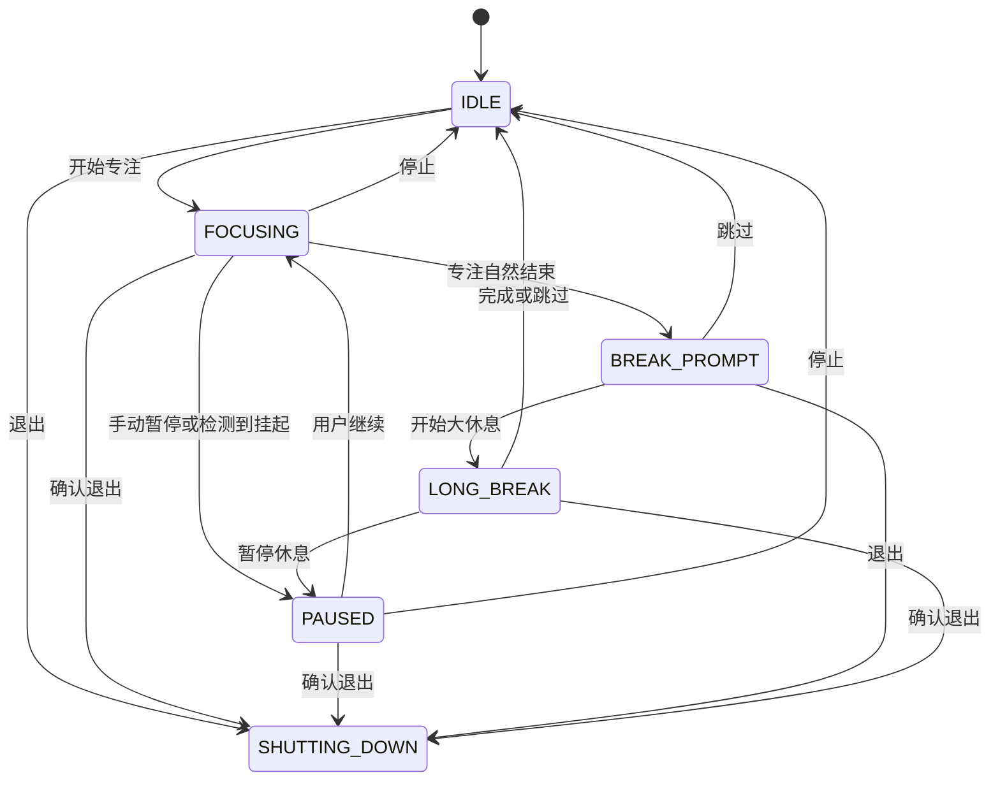

# CountdownApp V2 重构与新专注算法设计

> 状态：已实现并持续验证  
> 更新日期：2026-07-15  
> 目标平台：Windows 10/11（x64）  
> 当前交付范围：设计合同与当前实现说明

## 1. 文档目的

本文件是 CountdownApp 下一轮重构的实现合同。它统一以下需求：

- 修复现有计时、暂停、停止、音频、托盘、配置和退出问题；
- 保留原来的随机提醒能力，并新增三阶段 V2 专注算法；
- 使用操作系统级安全随机源，使提醒时间对用户不可预测；
- 吸收上游 PR #2 中有价值的产品意图，但不直接合并其代码；
- 覆盖上游 Issue #1 和 Issue #3；
- 为以后增加“走神/没走神”反馈和自适应调频预留接口，本轮不实现自适应。

本文中的时间和微休息设计属于产品节律假设，不应宣传为医学结论。持续任务可能出现注意波动，微休息对疲劳和活力通常有帮助，但具体阈值和绩效收益因人、任务与环境而异。

## 2. 已冻结的产品决策

| 项目 | 决策 |
| --- | --- |
| 随机源 | 使用 Python `secrets.SystemRandom`，即操作系统级密码学安全随机；不宣称物理真随机 |
| 算法模式 | 同时保留 Classic 和 V2 |
| 短任务默认 | 总时长小于 60 分钟时默认 Classic，但用户可以手动启用 V2 |
| V2 最短时长 | 15 分钟；不足 15 分钟不允许启用三阶段 V2 |
| V2 配置 | 提供默认曲线；高级设置允许修改阶段边界与各阶段间隔 |
| 默认提醒频率 | 平衡型：前期 4–7 分钟、中期 10–15 分钟、后期 5–8 分钟 |
| 提醒强度 | 提供“平衡”和“强干预”两个预设 |
| 微休息 | 默认 10 秒，并计入用户设置的总专注周期 |
| 大休息 | 专注结束后询问是否启动；默认 20 分钟，可修改或跳过；不强制黑屏 |
| 手动暂停 | 冻结专注进度，并保留已抽取提醒的剩余等待时间 |
| 睡眠恢复 | 检测到异常长的调度间隔后自动暂停；丢弃过期提醒，等待用户确认后重新抽取 |
| 主窗口关闭 | 可配置为隐藏到托盘（不占任务栏）或退出；活动周期退出前确认 |
| 持续背景音 | 噪音底色与 Solfeggio 单频独立选择，可单独或组合播放；仅在专注期播放并跟随暂停、结束和退出 |
| 强提醒焦点 | 可以置顶和覆盖屏幕，但不调用 `focus_force()` 强抢系统焦点 |
| GUI 技术 | 继续使用 Tkinter，但拆分计时、状态、提醒、音频、配置和托盘职责 |
| 首版用途 | 个人本机验证；许可证问题解决前不公开分发衍生 EXE |

## 3. 算法定义

### 3.1 时间与随机源

所有运行时间都以 `time.monotonic()` 为唯一事实来源。Tkinter 的 `after()` 只用于唤醒和刷新界面，不能通过“每秒减一”计算剩余时间。

生产环境的随机实现为：

```python
from secrets import SystemRandom

rng = SystemRandom()
interval_seconds = rng.randint(min_seconds, max_seconds)
```

规则：

- 在包含端点的整数秒区间内均匀抽取；
- 不调用全局 `random` 模块；
- 不依赖网络或外接随机硬件；
- 业务层依赖 `RandomSource` 接口，而不是直接依赖具体实现；
- 自动测试注入可预测的假随机源，不对真实随机序列编写易波动的统计断言。

“系统安全随机”表示使用操作系统可提供的最高质量随机源，不等于可证明的物理真随机。

### 3.2 Classic 模式

Classic 保留 Issue #3 所要求的自定义触发时间能力：

- 用户设置统一的最小和最大提醒间隔；
- 每次提醒完成调度后，从该区间重新抽取下一次间隔；
- 不存在阶段切换；
- 平衡提醒预设使用半透明微休息遮罩；
- 强干预预设使用黑色全屏倒计时。

Classic 是总时长小于 60 分钟时的默认模式，也是希望完全自行控制间隔用户的兼容模式。

### 3.3 V2 三阶段模式

设总专注时长为 `D` 秒，活动专注时间为 `t`：

| 阶段 | 边界 | 90 分钟示例 | 默认随机间隔 | 产品目的 |
| --- | --- | ---: | ---: | --- |
| 注意力锚定期 | `0 ≤ t < D/3` | 0–30 分钟 | 4–7 分钟 | 较密集地检查任务是否偏移 |
| 深度专注期 | `D/3 ≤ t < 13D/18` | 30–65 分钟 | 10–15 分钟 | 降低干扰，保护连续思考 |
| 疲劳维护期 | `13D/18 ≤ t < D` | 65–90 分钟 | 5–8 分钟 | 增加微休息机会，提醒身体放松 |

用户手动为不足 60 分钟的任务启用 V2 时，仍按以上比例压缩完整三阶段。例如 30 分钟会得到约 0–10、10–21.7、21.7–30 分钟三个阶段。

高级设置允许用户覆盖：

- 锚定期结束时间；
- 疲劳维护期开始时间；
- 三个阶段各自的最小和最大随机间隔。

高级边界必须满足：

```text
0 < 锚定期结束 < 疲劳维护期开始 < 总时长
```

### 3.4 调度规则

调度器只产生四类事件：

- `REMINDER_DUE`：提醒到期；
- `PHASE_CHANGED`：进入新阶段；
- `SESSION_FINISHED`：专注结束；
- `SUSPEND_DETECTED`：检测到睡眠、挂起或严重卡顿。

具体规则：

1. 会话开始时根据活动时间确定当前阶段，再从该阶段范围抽取一次间隔。
2. 若抽取出的提醒截止时间跨越下一个阶段边界，不在边界强行提醒；先等待阶段切换，再使用新阶段范围重新抽取。
3. 若提醒截止时间超过会话结束时间，取消该提醒，只等待会话结束。
4. 任意时刻最多存在一个待触发提醒和一个可见提醒。
5. 提醒可见期间不会生成第二个提醒；微休息时间仍计入总专注周期。
6. 若会话在提醒可见期间结束，先关闭提醒和声音，再进入大休息确认，且只进入一次。
7. 手动暂停保存专注剩余时间、当前阶段、下一提醒剩余时间；恢复时继续原计划，不重新随机。
8. Tk 调度心跳间隔异常超过 10 秒时，视为睡眠或挂起：停止声音、关闭当前提醒、使会话进入暂停并丢弃旧提醒。用户确认继续后重新抽取。
9. 停止、退出或开始新会话都会使旧 `session_id` 失效；任何属于旧会话的回调必须立即返回。

## 4. 提醒表现

### 4.1 平衡预设

| 阶段 | 默认表现 |
| --- | --- |
| 注意力锚定期 | 播放提示音；显示 5 秒不抢焦点提示条，默认文案“我还在原任务上吗？” |
| 深度专注期 | 播放提示音并发送 Windows 通知，不创建抢占工作区的窗口 |
| 疲劳维护期 | 播放提示音；显示 10 秒半透明全屏微休息遮罩，可按 Esc 或“跳过”按钮关闭 |

Classic 模式选择平衡预设时，使用疲劳维护期的半透明遮罩。

### 4.2 强干预预设

| 阶段 | 默认表现 |
| --- | --- |
| 注意力锚定期 | 播放提示音；显示置顶小窗 |
| 深度专注期 | 播放提示音并发送 Windows 通知 |
| 疲劳维护期 | 播放提示音；显示黑色置顶全屏倒计时，可按 Esc 或“跳过”按钮关闭 |

Classic 模式选择强干预预设时，保留原应用的黑色全屏体验。

所有提醒都必须满足：

- 在加载或播放音频之前先创建退出按钮并绑定 Esc；
- 不使用 `focus_force()`；
- 默认只覆盖应用所在的显示器，不覆盖全部显示器；
- 音频失败不能阻止倒计时、关闭按钮或 Esc 工作；
- 关闭提醒时同时停止本次提示音；
- 用户停止会话时立即关闭所有提醒。

## 5. 大休息流程

专注自然结束后进入 `BREAK_PROMPT`，显示普通应用窗口而不是强制遮罩：

- “开始 20 分钟休息”；
- “修改时长”；
- “跳过并结束”；
- “退出程序”。

默认大休息为 20 分钟。大休息开始后：

- 在主窗口显示倒计时；
- 可以暂停、继续、跳过或最小化到托盘；
- 使用 `time.monotonic()`；
- 不产生随机微休息；
- 结束时播放一次提示音并回到空闲界面；
- 不自动退出程序。

## 6. 状态与线程模型

### 6.1 会话状态



提醒是否显示使用独立的 `ReminderState = NONE | VISIBLE`，不能创建第二套专注计时状态。

### 6.2 单线程 GUI 调度

- 删除后台计时线程；
- Tk 主线程每 500 毫秒检查一次单调时钟和到期事件；
- 倒计时文字只在显示秒数变化时更新；
- 托盘命令每 250 毫秒轮询一次，避免高频空轮询；
- 所有 Tk 创建、销毁、恢复、退出操作都在主线程执行；
- 托盘线程只向线程安全队列写入命令，由 Tk 主线程消费；
- 保存所有 `after()` 标识，并在停止或退出时取消；
- 每个回调携带 `session_id`，防止停止后快速重启导致旧回调复活。

## 7. 界面与输入

### 7.1 设置界面

设置界面提供：

- 高频设置使用单列布局，低频的提醒强度、声音和系统行为选项默认收纳在“更多设置”；
- V2 三阶段摘要位于主设置页，阶段边界和完整间隔使用独立设置窗口；
- 设置页提供纵向滚动条与鼠标滚轮支持，以适配高 DPI 和较小屏幕；
- 持续背景音收纳在“更多设置”，噪音底色与 Solfeggio 频率使用两个独立下拉框，提供共用总音量、试听组合和停止，避免挤占高频计时选项；

- 总时长快捷按钮：30、60、90 分钟；
- 自定义总时长；
- 算法选择：Classic / V2；
- Classic 最小和最大间隔；
- V2 当前三阶段摘要；
- 独立的 V2 节律设置窗口；
- 提醒强度：平衡 / 强干预；
- 微休息时长，默认 10 秒；
- 休息倒计时开关，默认开启；
- 大休息时长，默认 20 分钟；
- 相互独立的微休息开始铃与回归专注铃，默认分别使用 `0.wav` 与 `1.wav`，均支持内置音频、自定义音频和试听；
- 开始和退出。

不足 60 分钟时算法默认选择 Classic，但不禁用 V2。不足 15 分钟时 V2 选项禁用并解释原因。

### 7.2 运行界面

运行界面显示：

- 总剩余时间；
- 当前算法和当前阶段；
- 当前阶段的随机区间；
- 暂停、停止、最小化到托盘。

不显示已经抽取的准确提醒时刻，以保持不可预测性。

### 7.3 输入校验

开始按钮执行一次完整校验，不允许异常进入调度器：

- 所有必填值必须是有限数字；
- 总时长必须为正；
- 所有随机间隔必须为正，且最小值不大于最大值；
- 微休息和大休息时长必须为正；
- V2 阶段边界必须严格递增并位于总时长内；
- 自定义音频必须存在、可读且扩展名受支持；
- 某阶段短于其最小提醒间隔时允许保存，但显示“该阶段可能没有提醒”的警告；
- 错误必须显示在对应输入项附近，并阻止启动，不能只在控制台打印。

## 8. 音频设计与 Issue #1

Issue #1 只描述“窗口缩小或不在当前页面时有时无声”，没有复现步骤、日志或评论，因此目前不能断言单一根因。V2 通过隔离音频职责和增加诊断能力覆盖已知风险。

### 8.1 持续背景音

- 白噪音、粉红噪音、低频更强的棕噪音和近似等响度的灰噪音由程序本地合成；
- 单频选项为 174、285、396、417、528、639、741、852、963 Hz；
- 两个选择均可独立关闭；选择一项时单独播放，同时选择时预先混合为一个限幅循环缓冲；
- 生成约 2 秒的 16 位 PCM 缓冲后交给 SDL mixer 无限循环，专注过程中不持续生成采样；
- 背景音使用独立 `Sound` 声道，开始铃和回归铃继续使用提示铃声道；
- 手动暂停或检测到系统挂起时暂停，继续专注时恢复；进入大休息、停止或退出时停止；
- Solfeggio 标签仅表示所选声波频率，不构成医疗、治疗或认知效果声明。

### 8.2 后端

- 使用支持 Python 3.14 的 `pygame-ce`，源码仍通过 `import pygame` 使用兼容 API；
- 删除 `playsound`；
- 不在模块导入阶段初始化 mixer；
- 第一次试听或提醒时延迟初始化；
- 使用单一 `AudioEngine` 持有 pygame 全局 mixer，统一管理提示铃、背景音、设备重试和降级；
- 提示铃播放时自动降低背景音量，停止后恢复，避免提示被持续噪音掩盖；
- 音频设备重建后恢复原背景音选择和音量；
- 背景音按声音组合缓存短 PCM 缓冲，同一组合再次试听时不重新合成；
- 支持 `.wav`、`.ogg`、`.mp3`，最终是否可播放以实际加载结果为准。

### 8.3 失败策略

1. 播放前检查路径和文件可读性。
2. 播放失败时记录异常，并重新初始化 mixer 一次。
3. 重试仍失败时调用 Windows `winsound.MessageBeep()`。
4. 降级成功或失败都不能中断 GUI 流程。
5. 用户切换音频设备、睡眠恢复或停止会话时，释放当前声音并允许下次重新初始化。

### 8.4 日志

日志写入安装目录下的 `Logs\countdown.log`，采用轮转策略，不记录用户文档内容。至少记录：

- 应用版本、Python 版本和 Windows 版本；
- mixer 初始化结果和音频设备错误；
- 选用的音频类型，但自定义路径只记录文件名；
- 主窗口可见、隐藏或托盘状态；
- 提醒计划、实际触发时间和延迟；
- 睡眠检测、暂停、恢复、停止和退出；
- 音频重试与系统音降级结果。

## 9. 配置与迁移

采用便携式配置，配置文件固定写在程序安装目录：

```text
<安装目录>\settings.json
```

配置采用带 `schema_version` 的 JSON，并包含：

- 算法模式；
- 总时长和快捷选项；
- Classic 间隔；
- V2 自动/自定义边界及三个阶段范围；
- 提醒强度；
- 微休息和大休息时长；
- 开始铃和回归铃各自的音频选择及自定义音频路径；
- 是否启用休息倒计时；
- 是否完成旧配置迁移。

保存采用“同目录临时文件写入成功后原子替换”，避免异常退出产生半个配置文件。

首次启动且新配置不存在时，依次检查程序目录和当前工作目录中的旧 `settings.ini`：

- 只迁移有效的 `custom_audio_path`；
- 不删除或覆盖旧文件；
- 迁移失败使用默认值并写日志；
- 新配置建立后不重复迁移。

## 10. 模块边界

重构后采用小型包结构，职责按以下边界划分：

| 模块职责 | 内容 |
| --- | --- |
| 应用与 UI | Tk 窗口、表单、运行界面、提醒视图和主线程命令分发 |
| 领域状态 | 设置数据、状态枚举、输入校验和状态转换 |
| 调度器 | 单调时钟、Classic/V2 阶段、随机间隔和到期事件 |
| 提醒服务 | 平衡/强干预预设、通知、小窗和遮罩生命周期 |
| 音频服务 | `pygame-ce`、试听、重试、停止和系统音降级 |
| 配置与日志 | 安装目录、旧配置迁移、原子保存和轮转日志 |
| 托盘服务 | 菜单与线程安全命令，不直接操作 Tk |

核心层不得导入 Tkinter、pygame 或 pystray，以便用假时钟和假随机源进行快速测试。

建议公开的内部类型：

```text
AlgorithmMode = CLASSIC | V2
ReminderPreset = BALANCED | STRONG
SessionState = IDLE | FOCUSING | PAUSED | BREAK_PROMPT | LONG_BREAK | SHUTTING_DOWN
ReminderState = NONE | VISIBLE
V2Phase = ATTENTION_ANCHOR | DEEP_FOCUS | FATIGUE_SUPPORT
```

调度器接口接收 `SessionSettings`、`Clock` 和 `RandomSource`，输出领域事件，不直接显示窗口或播放声音。

## 11. 托盘、停止与退出

- 开启“关闭到托盘”时，关闭主窗口会从任务栏隐藏但保持程序运行；
- 关闭该选项时，关闭主窗口会退出；活动周期退出前要求确认；
- 托盘菜单至少提供打开主界面、暂停/继续、停止当前周期和退出程序；双击默认打开主界面；
- 开机启动使用当前用户的 Windows Run 启动项，不要求管理员权限；可选择正常显示主界面，或带 `--startup` 参数在 Tk 主循环前静默到托盘；托盘初始化失败时保留主窗口；
- “退出程序”在活动周期中要求确认；
- 统一退出顺序：标记 `SHUTTING_DOWN`、使 `session_id` 失效、取消回调、停止音频、关闭提醒、保存配置、停止托盘、销毁 Tk 根窗口；
- 不以 `root.quit()` 作为唯一清理动作。

## 12. 依赖与打包

运行依赖只保留直接使用的库：

- `pygame-ce`；
- `Pillow`；
- `pystray`；

删除：

- 未使用的 `playsound`；
- Python 3 标准库已经包含的 `configparser` 回移植包；
- 作为间接依赖或构建依赖混入运行 requirements 的条目。

开发与打包依赖单独维护，包括 `pytest` 和当前支持 Python 3.14 的 PyInstaller。个人验证阶段优先生成 `onedir`、`windowed` 构建，便于检查资源和日志；稳定后再评估单文件构建。

PyInstaller 配置必须包含：

- `1.wav`、`2.wav`、`3.wav`、`4.mp3`；
- `clock_icon.ico`；
- 应用版本信息；
- 实际需要的 pygame-ce、Pillow 和 pystray 资源。

当前 spec 只包含未使用的 `ding.wav`，不得继续作为有效发布配置。

## 13. 上游 PR 与 Issue 处理

### 13.1 PR #2

上游 PR：<https://github.com/silentcaty/CountdownApp-v2.0/pull/2>

结论：不合并、不 cherry-pick，只吸收需求意图。

吸收：

- 30/60/90 分钟快捷选择；
- 开始和停止时正确重置暂停状态；
- 暂停/继续按钮的明确反馈。

拒绝直接采用的实现：

- PR 基于旧代码，当前处于冲突状态；
- 固定 6–8 分钟间隔与 V2 三阶段目标冲突；
- GUI 和后台循环都可能触发结束休息，造成重复弹窗；
- 暂停期间墙钟继续累计，恢复后会提前结束；
- 同一个弹窗倒计时函数被启动两次；
- 代码使用 22% 休息比例，但 README 写 20%；
- 90 分钟对应 1188 秒，并不等于代码判断的 1200 秒；
- 继续依赖旧 `playsound`，没有解决 Issue #1；
- PR 携带压缩二进制文件，不作为源码改进的一部分接收。

### 13.2 Issue #1：后台或最小化后偶发无声

上游 Issue：<https://github.com/silentcaty/CountdownApp-v2.0/issues/1>

由以下验收项覆盖：

- mixer 延迟初始化；
- 后台、托盘和窗口隐藏状态均可播放；
- 音频设备错误可重试；
- 文件失效可降级为系统提示音；
- 音频失败不留下无法退出的全屏窗口；
- 日志足以区分初始化、文件、设备和调度问题。

由于原 Issue 没有复现细节，只有完成 Windows 实机测试后才能确认具体根因和是否完全关闭。

### 13.3 Issue #3：自定义触发时间

上游 Issue：<https://github.com/silentcaty/CountdownApp-v2.0/issues/3>

由以下功能覆盖：

- Classic 自定义最小/最大随机间隔；
- V2 高级阶段边界和各阶段间隔；
- 30/60/90 快捷总时长及自定义总时长；
- 完整输入校验和设置持久化。

## 14. 测试计划

### 14.1 单元测试

- Classic 抽样始终位于包含端点的配置区间；
- 90 分钟 V2 在 30 和 65 分钟处正确切换阶段；
- 30 分钟手动 V2 正确压缩三阶段；
- 跨阶段候选不会在边界触发，而是在新阶段重新抽取；
- 候选超过会话结束时不会产生结束后的普通提醒；
- 手动暂停保持下一提醒剩余等待；
- 睡眠恢复丢弃旧提醒并等待确认；
- GUI 回调延迟不会造成显示漂移；
- 停止后快速重启不会执行旧会话回调；
- 同一时间最多一个提醒，结束确认只出现一次；
- 所有无效输入均被拒绝；
- 旧 `settings.ini` 只迁移一次；
- 配置写入失败不会破坏上一份有效配置。

### 14.2 集成测试

- 主窗口可见、最小化和托盘运行三种状态下均能播放声音；
- 自定义音频被删除后使用系统音降级；
- 模拟 mixer 初始化失败后 GUI 仍可操作；
- 平衡和强干预预设显示正确，并始终可 Esc/跳过；
- 暂停、停止和退出会同步关闭窗口与声音；
- 系统睡眠恢复后不会立即连发过期提醒；
- 主窗口关闭、托盘恢复和托盘退出不跨线程调用 Tk；
- 大休息只在确认后开始，完成后回到空闲状态。

### 14.3 打包验收

- 在干净 Windows 测试环境中启动，无需安装 Python；
- 四个内置音频和托盘图标都能加载；
- 安装目录中的配置与日志位置正确；
- 从任意工作目录启动都不依赖当前目录；
- 无控制台窗口时异常仍能写入日志；
- 连续运行一个完整 90 分钟周期，无漂移、重复提醒或残留进程。

## 15. 完成标准

下一轮实现只有同时满足以下条件才能称为 V2 完成：

1. Classic、短时手动 V2 和 90 分钟 V2 均通过自动测试。
2. 所有计时由单调时钟驱动，GUI 回调不是时间事实来源。
3. 不存在结束后继续普通提醒、双重长休息或停止后旧会话复活。
4. Issue #1 的后台播放场景通过实机测试，并在失败时可从日志定位原因。
5. Issue #3 的自定义时间与校验完整可用。
6. PR #2 的快捷时长和暂停意图被重新实现，但不引入其已知缺陷。
7. 平衡模式不抢焦点，强干预模式也保留明确退出通道。
8. 配置、日志、托盘、音频、提醒窗口和进程能够统一清理。
9. PyInstaller 构建包含全部实际资源，并在干净 Windows 环境通过冒烟测试。

## 16. 本轮不做

- “走神/没走神”反馈记录；
- 根据反馈自动增减提醒频率；
- 屏幕共享自动检测；
- 考试模式和应用白名单；
- 多台设备同步、账号、云服务或遥测；
- macOS 和 Linux 支持；
- 在许可证未解决前公开发布衍生 EXE。

## 17. 许可证与资料边界

当前上游仓库没有明确许可证。公开可见源码并不自动授予复制、修改和重新发布权。本项目在获得作者授权或上游补充许可证前，仅按个人验证项目处理；不得擅自给继承代码添加新许可证，也不得公开发布衍生安装包。

参考资料：

- Python `secrets`：<https://docs.python.org/3/library/secrets.html>
- Python `random` 与 `SystemRandom`：<https://docs.python.org/3/library/random.html>
- 微休息系统综述与元分析：<https://pubmed.ncbi.nlm.nih.gov/36044424/>
- `pygame-ce` Python 3.14 支持：<https://pypi.org/project/pygame-ce/>
- PyInstaller 当前兼容范围：<https://pypi.org/project/pyinstaller/>
